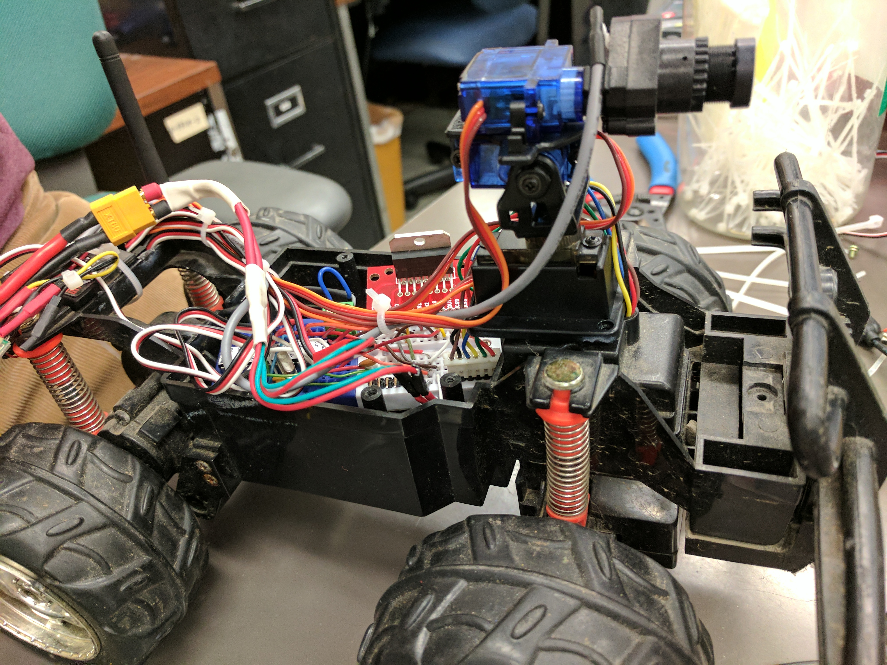
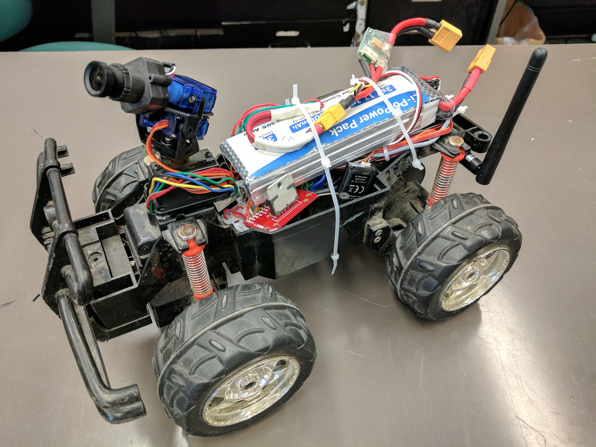
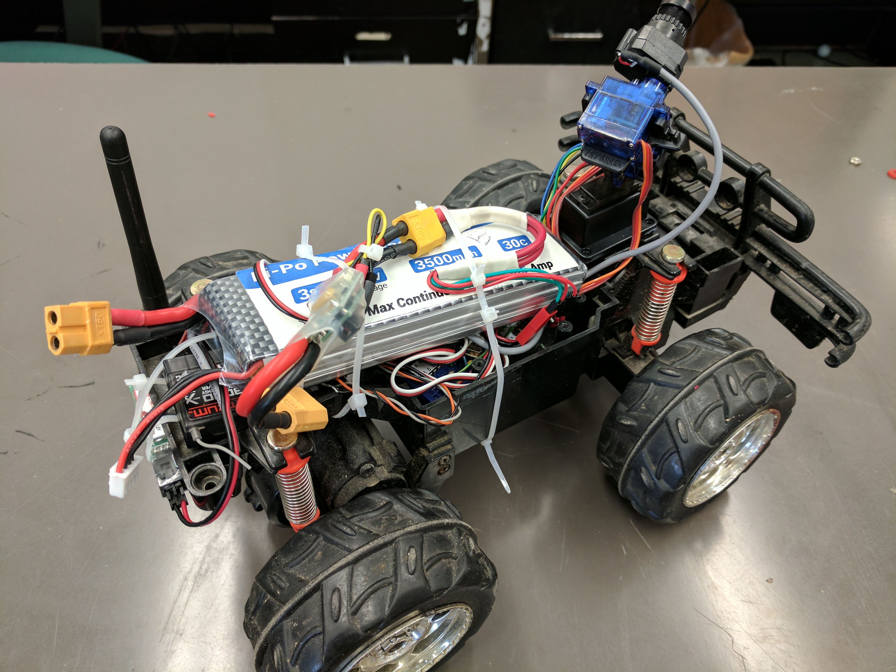

# fpv-truck
RC Truck body/motors with dual h-bridge, Arduino brains and Spektrum RC receiver + pan/tilt/roll camera with live stream.

Paired with the FatShark Dominator v3 for an immersive driving experience. Head tracking unit also used with FatShark headset so pan/tilt/roll of transmitting camera is controlled by head motion.

There is a 5.8Ghz video transmitter above the back wheels, with the RC receiver above that. PWM signals for the throttle and steering channels are intercepted by the Arduino which measures and scales them, in turn controlling the drive and steering motors with a L298N dual h-bridge.

Here are some images of it being built. 

